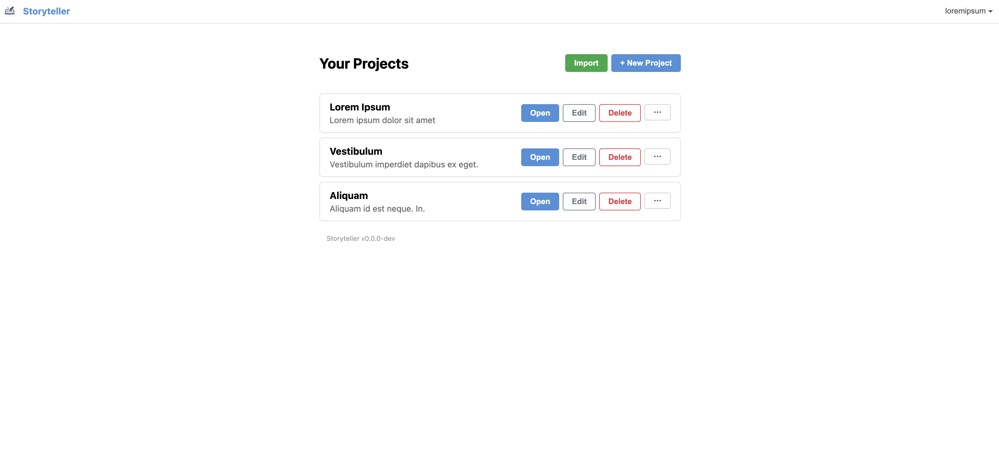
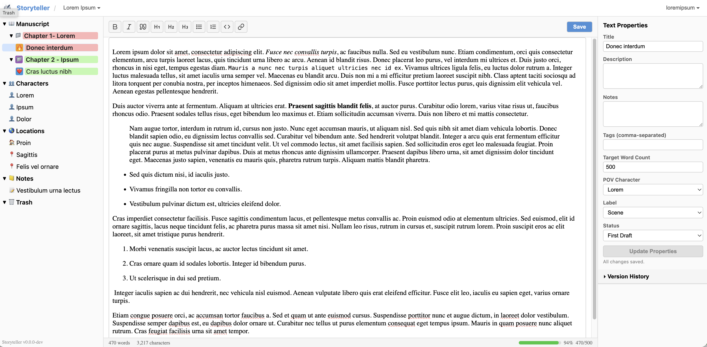

<div align="center" width="100%">
  
</div>

---

[](https://github.com/awilner/storyteller/actions/workflows/docker-image-ci-build.yml)


# Storyteller

A web-based writing application for novelists and authors. Organize your manuscript into chapters and scenes, manage characters, locations, and notes, track progress with labels and statuses, and compile your work into multiple output formats.

## About The Project
I created this after looking for a self-hosted version of apps like Scrivener or Manuskript, mainly because I couldn't install them on a company-issued laptop and remote connection tools like VNC are also not allowed.

## Features

- Hierarchical project tree with drag-and-drop reordering
- Rich text editor (TipTap/ProseMirror) with markdown storage
- Real-time collaborative editing via Yjs CRDTs and HocusPocus
- Project sharing with role-based access (co-author, read-only)
- Per-object permission overrides for fine-grained access control
- Per-user progress tracking with daily and session word count targets
- Contribution ranking showing each collaborator's total word contributions
- Characters, locations, items, and notes alongside your manuscript
- POV character, label, and status metadata per folder/text
- Configurable colour coding in the project tree
- Compile to DOCX, PDF, EPUB, RTF, LaTeX, Markdown, and MOBI (via Pandoc)
- Customizable compile layouts (fonts, margins, chapter headings, scene separators)
- Front matter and back matter support
- Version history with revert
- Trash folder with soft-delete and permanent delete
- Import from Scrivener (.scriv.zip) and yWriter7 (.yw7)
- Export to Scrivener and yWriter formats
- Duplicate items and copy between projects
- OIDC single sign-on (optional)
- Internationalization support
- Mobile-responsive layout
- Auto-save with configurable interval

## Architecture

```
┌──────────┐     ┌──────────────┐     ┌──────────┐
│ Frontend │────▶│   Backend    │────▶│ MariaDB  │
│  nginx   │:80  │ Daphne/ASGI  │:8000│          │:3306
│          │     │   Pandoc     │     │          │
│          │     └──────────────┘     └──────────┘
│          │            │
│          │     ┌──────────────┐     ┌──────────┐
│          │────▶│ HocusPocus   │────▶│  Redis   │:6379
│          │     │  Yjs server  │:1234│          │
└──────────┘     └──────────────┘     └──────────┘
```

- **Frontend**: React SPA served by nginx, proxies `/api/` to the backend, `/ws/` to Django Channels, `/yjs/` to HocusPocus
- **Backend**: Django + Django REST Framework + Django Channels (ASGI via Daphne), with Pandoc for document compilation
- **HocusPocus**: Node.js Yjs WebSocket server for real-time collaborative editing, authenticates via callback to the Django backend
- **MariaDB**: persistent storage for projects, folders, files, metadata
- **Redis**: Django Channels channel layer, HocusPocus document sync, and draft caching

## Real-Time Synchronization

Storyteller uses two complementary real-time channels:

### Document Editing (HocusPocus / Yjs)

Text content is synchronized via Yjs CRDTs through the HocusPocus WebSocket server. When two users edit the same file, changes merge automatically with no conflicts. Cursors and selections are shared in real time.

### Project Events (Django Channels)

All other collaborative state — the project tree, settings, labels, statuses, and permissions — is synchronized through a Django Channels WebSocket at `/ws/projects/<id>/`. When any user makes a change, the backend broadcasts an event to all connected clients, which then refresh the affected data.

| Event | Triggered by |
|---|---|
| `tree_changed` | Create, update, delete, reorder, duplicate folders/files; empty trash; copy to project |
| `settings_changed` | Update project title, description, or settings |
| `labels_changed` | Create, update, or delete a label |
| `statuses_changed` | Create, update, or delete a status |
| `layouts_changed` | Create, update, or delete a compile layout |
| `permission_changed` | Create, update, or delete a share or per-object override |
| `access_revoked` | Remove a collaborator's access (closes their connection) |

The broadcast system is extensible — adding a new event type requires only a one-line `broadcast_project_event()` call in the backend view and an optional handler in the frontend. See the [backend README](backend/README.md) for details.

## Deployment with Docker

Pre-built images are available from GitHub Container Registry.

### 1. Get the configuration files

Copy [`docker/docker-compose.yml`](docker/docker-compose.yml) and [`docker/.env.example`](docker/.env.example) to your deployment directory:

```bash
mkdir storyteller && cd storyteller
curl -O https://raw.githubusercontent.com/awilner/storyteller/main/docker/docker-compose.yml
curl -O https://raw.githubusercontent.com/awilner/storyteller/main/docker/.env.example
```

### 2. Configure environment

```bash
cp .env.example .env
```

Edit `.env` and set real values for at least:
- `DJANGO_SECRET_KEY` — a long random string
- `DB_PASSWORD` and `MARIADB_ROOT_PASSWORD` — database credentials
- `CORS_ALLOWED_ORIGINS` and `CSRF_TRUSTED_ORIGINS` — your domain (e.g. `https://my.domain.com`)
- `HOCUSPOCUS_SECRET` — a shared secret between HocusPocus and the backend
- `COOKIE_SECURE=True` — when serving over HTTPS

See [`docker/.env.example`](docker/.env.example) for all available options.

### 3. Start the stack

```bash
docker compose up -d
```

The application is now available at `http://localhost` (or your configured domain behind a reverse proxy).

### HTTPS

Storyteller expects to run behind a reverse proxy (e.g. Caddy, Traefik, or nginx) that terminates TLS. The frontend nginx container listens on port 80 and forwards the `X-Forwarded-Proto` header to the backend. Set `COOKIE_SECURE=True` in `.env` when serving over HTTPS.

### Updating

```bash
docker compose pull
docker compose up -d
```

Migrations run automatically on backend startup.

## Local Development

See the individual READMEs for development setup:

- [Backend](backend/README.md) — Django API, Python 3.10+
- [Frontend](frontend/README.md) — React SPA, Node.js 18+
- [HocusPocus](hocuspocus/README.md) — Collaborative editing server, Node.js 18+
- [Docker](docker/README.md) — Building images locally

### Quick Start (all services)

```bash
# Terminal 1 — Backend
cd backend && python -m venv .venv && source .venv/bin/activate
pip install -r requirements.txt && python manage.py migrate
python manage.py runserver

# Terminal 2 — HocusPocus (Redis optional for local dev)
cd hocuspocus && npm install
HOCUSPOCUS_AUTH_URL=http://127.0.0.1:8000/api/internal/yjs-auth/ npm start

# Terminal 3 — Frontend
cd frontend && npm install && npm run dev
```

Open `http://localhost:5173`.

## Screenshots


